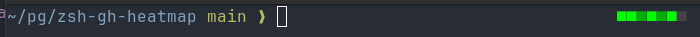

# zsh-gh-heatmap

A zsh plugin that shows your GitHub activity for the past 7 days as a coloured heatmap in your shell prompt — displayed only when you're inside a git repository.



```
■■■■■■■   ← 7 blocks, one per day (oldest → today)
```

Colours map to contribution count per day:

| Colour | Count |
|--------|-------|
|  dark gray | 0 |
|  dark green | 1–2 |
|  medium green | 3–5 |
|  green | 6–10 |
|  bright green | 11+ |

Activity data comes from the **GitHub GraphQL API** (full contribution calendar, including private repos) when a token is available, with a fallback to the **REST Events API** (public activity only) when it is not.

---

## Requirements

- zsh
- `curl`
- `python3` (stdlib only)
- A GitHub account

---

## Installation

### Oh My Zsh (manual)

```zsh
git clone https://github.com/pgmac/zsh-gh-heatmap \
  "${ZSH_CUSTOM:-$HOME/.oh-my-zsh/custom}/plugins/gh-heatmap"
```

Add `gh-heatmap` to your plugins in `~/.zshrc`:

```zsh
plugins=(... gh-heatmap)
```

### zinit

```zsh
zinit light pgmac/zsh-gh-heatmap
```

### antigen

```zsh
antigen bundle pgmac/zsh-gh-heatmap
```

### antibody

```zsh
antibody bundle pgmac/zsh-gh-heatmap
```

---

## Prompt integration

### Powerlevel10k (recommended)

Add `gh_heatmap` to `POWERLEVEL9K_RIGHT_PROMPT_ELEMENTS` in `~/.p10k.zsh`:

```zsh
typeset -g POWERLEVEL9K_RIGHT_PROMPT_ELEMENTS=(
  # ... your existing elements ...
  gh_heatmap
)
```

### Other themes / manual RPROMPT

Add this to `~/.zshrc` **after** `source $ZSH/oh-my-zsh.sh`:

```zsh
RPROMPT='$(gh_heatmap_segment) '$RPROMPT
```

---

## Configuration

Set these in `~/.zshrc` **before** the `plugins=` line:

```zsh
# GitHub username — auto-detected from GITHUB_USERNAME or `git config github.user` if unset
export GH_HEATMAP_USERNAME="your-username"

# GitHub Personal Access Token with read:user scope
# Enables full contribution data (private + public).
# Without this, only public events are shown.
export GH_HEATMAP_TOKEN="ghp_..."

# How long to cache API responses (seconds, default: 300)
export GH_HEATMAP_CACHE_TTL=300

# Where to store cached data (default: ~/.cache/gh-heatmap)
export GH_HEATMAP_CACHE_DIR="$HOME/.cache/gh-heatmap"
```

### Creating a token

1. Go to **GitHub → Settings → Developer settings → Personal access tokens → Fine-grained tokens**
2. Create a token with **read:user** scope (no repo access needed)
3. Export it as `GH_HEATMAP_TOKEN` in your `~/.zshrc`

---

## Commands

```zsh
# Force an immediate refresh (e.g. after a commit burst)
gh_heatmap_refresh
```

---

## How it works

- On each prompt in a git repo, the plugin checks whether the cache is stale (older than `GH_HEATMAP_CACHE_TTL`)
- If stale, a **background process** fetches fresh data — the prompt is never blocked
- The rendered block string is pre-computed and stored in `~/.cache/gh-heatmap/`; the prompt path only reads a small file
- The P10k `instant_prompt_gh_heatmap` variant ensures compatibility with Powerlevel10k's instant prompt feature

---

## License

MIT
